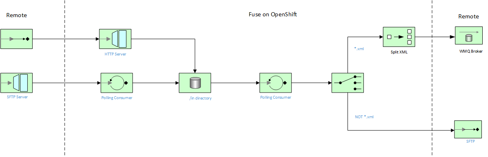

<h1 align="center">Managed File Transfer with WMQ using Fuse on Openshift</h1>

This project demonstrates a few simple MFT flows using Fuse on Openshift, including connectivity to an external WMQ message broker:

This flow includes the following services

1. [Flow One: HTTP Upload Endpoint](./http-upload-service)
2. [Flow Two: SFTP Download Endpoint](./sftp-download)
3. [Flow Three: File Split WMQ Producer](./wmq-producer)
4. [Flow Four: SFTP Push](./sftp-push)

Prerequisites
==============================

- Openshift 3.9+, Integreatly on RHPDS, or RHMI instance
- Fuse 7.3+ Image Streams
- Fuse Online 7.3+