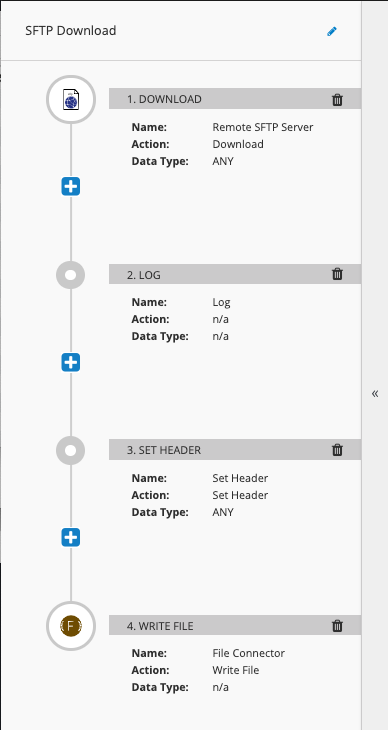
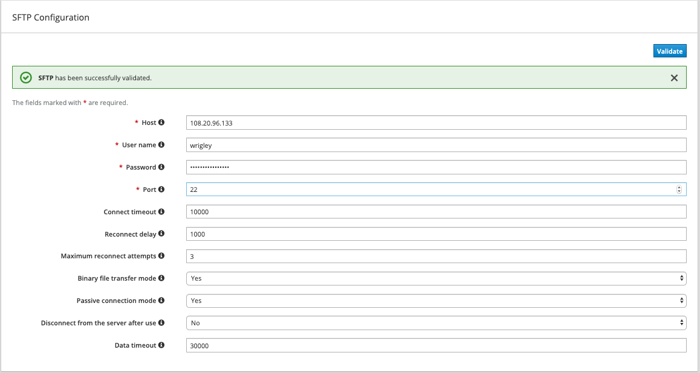
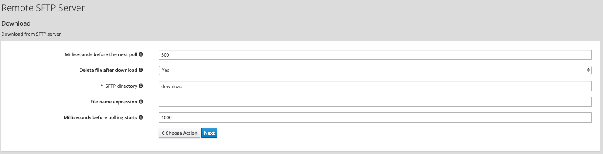

SFTP Download
=============

This flow polls a remote SFTP server and downloads files to the centralized `/mnt/mft/in` directory.

  

### Configuration

1. In Fuse Online, create a new Connection to your SFTP server.  It should look similar to below, and be sure to validate the connection

  

2. Build the `syndesis-connector-file2` step extension, and import it into Fuse Online.

3.  Create a Connector called `File Connector` using the imported step extension.

4.  Repeat steps 2 & 3 for the `syndesis-extension-manage-headers` step extension. 

5. Create a new Integration and add the following steps, as depicted in the image above.  For the remote SFTP server download configuration, be sure to use the following configuration

  

6. For the *Set Header* step, set the *Header name* to `CamelFileName` and *Header Value* to `${header.CamelFileNameConsumed}-${date:now:yyyyMMddHHmmssSSS}.ready`

7. Publish the flow and navigate to the `Shared Fuse` project in the OCP Web UI.

8. Once the SFTP integration is deployed, update the deployment config to attach the `nfs-pvc-01` storage.  Re-deploy the integration.

### Testing the flow

1.  Drop a file in the `/download` directory.
2. Once the file is consumed and deleted, navigate to the running Pod terminal (via OCP UI) and navigate to `/mnt/mft/` directory.  
3. Check the sub-directories to ensure the file has be routed correctly.